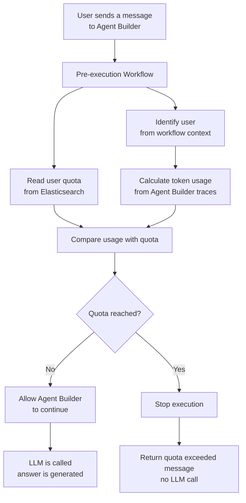
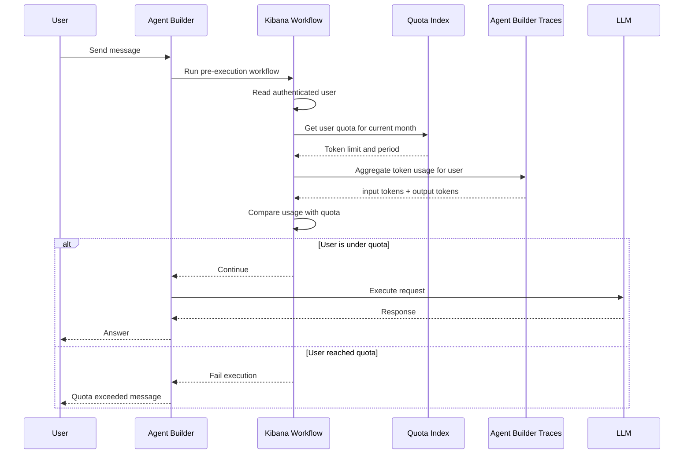

# Agent Builder Token Quota Control

## Goal

Agent Builder does not currently provide a native feature to stop a user when they reach a token quota.

This approach adds quota control using an Elastic workflow that runs before the Agent Builder execution. The workflow checks how many tokens the user has already consumed during the current period, compares that usage with a quota stored in Elasticsearch, and either allows or blocks the request.

## Prerequisites

Agent Builder tracing must be enabled so that token usage is written to Elasticsearch.

In Kibana advanced settings, enable:

```text
agentBuilder:tracing:enabled
```

When tracing is enabled, Agent Builder execution traces are collected in the following data stream:

```text
traces-agent_builder.otel-*
```

The workflow uses this data stream to calculate actual token consumption from:

```text
gen_ai.usage.input_tokens
gen_ai.usage.output_tokens
```

The user running the workflow must have enough privileges to:

- execute the workflow;
- read the quota index;
- read the Agent Builder trace data stream;
- attach the workflow to the Agent Builder agent.

## High-Level Architecture



## How It Works

When a user sends a message to Agent Builder, a Kibana workflow is executed first.

The workflow identifies the current user from the workflow execution context. This is important because the user identity comes from the authenticated Elastic/Kibana context, not from the prompt.

The workflow then looks up the user’s quota in an Elasticsearch index called:

```text
ai-agent-builder-user-quota
```

That index contains one document per user and period, for example:

```json
{
  "period": "monthly",
  "period_start": "2026-09-01T00:00:00.000Z",
  "period_end": "2026-10-01T00:00:00.000Z",
  "token_limit": 10000000,
  "enabled": true
}
```

Next, the workflow calculates the user’s actual token consumption from the Agent Builder trace data stored in:

```text
traces-agent_builder.otel-*
```

The token usage is calculated from the fields:

```text
gen_ai.usage.input_tokens
gen_ai.usage.output_tokens
```

The workflow adds both values together:

```text
total_used = input_tokens + output_tokens
```

It then compares:

```text
total_used >= token_limit
```

If the user is still under quota, the workflow lets Agent Builder continue normally.

If the user has reached or exceeded the quota, the workflow stops the execution and returns a deterministic refusal message, without calling the LLM.

## Main Data Flow



## How To Test It

### 1. Import the workflow

Add the workflow definition from this [GitHub repository](./assets/agent-builder-token-quota-workflow.yaml) to your elastic instance.

The workflow should:

1. identify the current workflow execution user;
2. compute the current month;
3. read the user quota from `ai-agent-builder-user-quota`;
4. aggregate token usage from `traces-agent_builder.otel-*`;
5. compare usage with the configured limit;
6. fail the workflow if the quota is reached.

Example workflow name:

```text
Enforce Agent Builder User Token Quota
```

Example workflow ID:

```text
enforce-agent-builder-user-token-quota
```

### 2. Create the quota index

Run the following commands in Kibana Dev Tools.

Create the index:

```http
PUT ai-agent-builder-user-quota
{
  "mappings": {
    "properties": {
      "user_id": {
        "type": "keyword"
      },
      "username": {
        "type": "keyword"
      },
      "period": {
        "type": "keyword"
      },
      "period_start": {
        "type": "date"
      },
      "period_end": {
        "type": "date"
      },
      "token_limit": {
        "type": "long"
      },
      "enabled": {
        "type": "boolean"
      },
      "warning_threshold": {
        "type": "float"
      },
      "created_at": {
        "type": "date"
      },
      "updated_at": {
        "type": "date"
      },
      "notes": {
        "type": "text"
      }
    }
  }
}
```

Add a quota document for a user with a monthly quota.

The document ID must match the value used by the workflow:

```text
<workflow execution user id>-<YYYY-MM>
```

Example:

```http
PUT ai-agent-builder-user-quota/_doc/fmaussion-2026-09
{
  "user_id": "fmaussion",
  "username": "3727848238",
  "period": "monthly",
  "period_start": "2026-09-01T00:00:00.000Z",
  "period_end": "2026-10-01T00:00:00.000Z",
  "token_limit": 10000000,
  "enabled": true,
  "warning_threshold": 0.8,
  "created_at": "2026-09-01T00:00:00.000Z",
  "updated_at": "2026-09-01T00:00:00.000Z",
  "notes": "Monthly Agent Builder quota"
}
```

For a blocking test, create or update the same document with a very low limit:

```http
PUT ai-agent-builder-user-quota/_doc/fmaussion-2026-09
{
  "user_id": "fmaussion",
  "username": "12345943213",
  "period": "monthly",
  "period_start": "2026-09-01T00:00:00.000Z",
  "period_end": "2026-10-01T00:00:00.000Z",
  "token_limit": 1000,
  "enabled": true,
  "warning_threshold": 0.8,
  "created_at": "2026-09-01T00:00:00.000Z",
  "updated_at": "2026-09-01T00:00:00.000Z",
  "notes": "Low limit used to test quota blocking"
}
```

Verify the document:

```http
GET ai-agent-builder-user-quota/_search
{
  "query": {
    "match_all": {}
  }
}
```

### 3. Verify Agent Builder traces

After sending at least one message to the agent, confirm that traces exist:

```http
GET traces-agent_builder.otel-*/_search
{
  "size": 5,
  "query": {
    "exists": {
      "field": "gen_ai.usage.input_tokens"
    }
  },
  "_source": false,
  "fields": [
    "@timestamp",
    "trace.id",
    "span.id",
    "span.name",
    "gen_ai.operation.name",
    "gen_ai.conversation.id",
    "gen_ai.usage.input_tokens",
    "gen_ai.usage.output_tokens",
    "user.id",
    "user.name"
  ],
  "sort": [
    {
      "@timestamp": "desc"
    }
  ]
}
```

You should see `chat` spans with token fields such as:

```text
gen_ai.usage.input_tokens
gen_ai.usage.output_tokens
```

You should also see `invoke_agent` spans that contain the user identity:

```text
user.id
user.name
```

### 4. Test the aggregation manually

Use the same logic as the workflow to calculate usage.

Replace the user ID and period values with your own:

```http
POST /_query
{
  "query": """
    FROM traces-agent_builder.otel-*
    | WHERE @timestamp >= TO_DATETIME("2026-09-01T00:00:00.000Z")
    | WHERE @timestamp < TO_DATETIME("2026-10-01T00:00:00.000Z")
    | EVAL input_l = TO_LONG(gen_ai.usage.input_tokens),
           output_l = TO_LONG(gen_ai.usage.output_tokens)
    | STATS input = SUM(input_l),
            output = SUM(output_l),
            user_id = VALUES(user.id)
      BY gen_ai.conversation.id
    | WHERE MV_CONTAINS(user_id, "fmaussion")
    | EVAL total = input + output
    | STATS input = SUM(input),
            output = SUM(output),
            total = SUM(total)
  """
}
```

Expected result:

```text
input   = total input tokens
output  = total output tokens
total   = input + output
```

### 5. Add the workflow to the agent

In Agent Builder:

1. Open the target agent.
2. Go to the workflow configuration section.
3. Add the quota workflow as a pre-execution workflow.
4. Save the agent.

The workflow must run before the agent starts calling the LLM.

### 6. Test allowed execution

Set a high token limit for the user:

```http
POST ai-agent-builder-user-quota/_update/fmaussion-2026-09
{
  "doc": {
    "token_limit": 10000000,
    "updated_at": "2026-09-24T00:00:00.000Z"
  }
}
```

Send a message to the agent.

Expected behavior:

- the workflow runs;
- the user quota document is found;
- token usage is calculated;
- usage is below the limit;
- Agent Builder continues normally;
- the LLM generates an answer.

Expected workflow result:

```text
User is within quota. Execution allowed.
```

### 7. Test blocked execution

Set a low token limit for the same user:

```http
POST ai-agent-builder-user-quota/_update/fmaussion-2026-09
{
  "doc": {
    "token_limit": 1000,
    "updated_at": "2026-09-24T00:00:00.000Z"
  }
}
```

Send another message to the agent.

Expected behavior:

- the workflow runs;
- token usage is calculated;
- usage is above the limit;
- the workflow fails intentionally;
- Agent Builder execution is stopped;
- no additional LLM call is made.

Expected refusal message:

```text
Your monthly Agent Builder token quota has been reached.
```

## Why This Works Well

The control happens before the expensive LLM execution starts.

That means when a user is already over quota, no additional model tokens are consumed just to tell them they are blocked.

The decision is also deterministic. The agent is not asked to decide whether the user is allowed. Elasticsearch and the workflow make the decision.